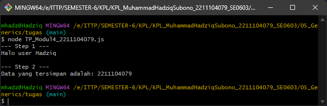
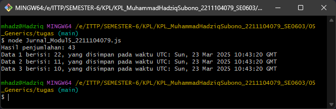

# Laporan Tugas Pendahuluan Modul 5

## Identitas Mahasiswa
- **Nama:** Muhammad Hadziq Subono  
- **NIM:** 2211104079  
- **Kelas:** SE06-C  

---

## 1. Source Code

### TP_Modul5_2211104079.js
```javascript
// STEP 1
// 1. Membuat class bernama "HaloGeneric"
class HaloGeneric {
    // 2. Menambahkan method "SapaUser" dengan generic parameter
    SapaUser(X) {
        console.log(`Halo user ${X}`);
    }
}

// STEP 2
// 1. Membuat class "DataGeneric" sesuai model
class DataGeneric {
    // Property "data" yang bertipe generic T
    constructor(data) {
        this.data = data;
    }
    
    // 2. Method PrintData
    PrintData() {
        console.log(`Data yang tersimpan adalah: ${this.data}`);
    }
}

// Fungsi utama
function main() {
    // STEP 1.3: Memanggil method SapaUser dengan input nama panggilan
    console.log("--- Step 1 ---");
    const haloObj = new HaloGeneric();
    haloObj.SapaUser("Hadziq"); // Ganti dengan nama panggilan Anda
    
    // STEP 2.3: Memanggil method PrintData setelah mengisi data dengan NIM
    console.log("\n--- Step 2 ---");
    const dataObj = new DataGeneric("2211104079"); // Menggunakan NIM Anda
    dataObj.PrintData();
}

// Menjalankan fungsi utama
main();
```

---

## 2. Screenshot Output



---

## 3. Penjelasan

1. **Bagaimana implementasi generic pada class HaloGeneric?**  
   Class `HaloGeneric` memiliki method `SapaUser` yang menerima parameter generik `X`. Meskipun JavaScript tidak memiliki sistem tipe data generik seperti Java atau C#, method ini dapat menerima parameter dengan tipe data apapun, yang secara implisit berperilaku seperti generic parameter.

2. **Apa kegunaan dari class DataGeneric?**  
   Class `DataGeneric` berfungsi untuk menyimpan dan menampilkan sebuah data dengan tipe generic. Dalam implementasi JavaScript, class ini dapat menyimpan data dengan tipe apapun dalam property `data`.

3. **Bagaimana cara kerja method PrintData dalam class DataGeneric?**  
   Method `PrintData()` bekerja dengan cara mencetak nilai yang tersimpan dalam property `data` dengan format "Data yang tersimpan adalah: [nilai data]" ke konsol.

4. **Bagaimana hasil pengujian class HaloGeneric dan DataGeneric dalam fungsi main?**  
   Pada fungsi `main()`, terdapat pengujian:
   - `HaloGeneric` dengan pemanggilan `SapaUser("Hadziq")` yang menghasilkan output "Halo user Hadziq"
   - `DataGeneric` dengan parameter NIM "2211104079" menghasilkan output "Data yang tersimpan adalah: 2211104079"

---

# Laporan Tugas Jurnal Modul 5

## 1. Source Code

### Jurnal_Modul5_2211104079.js
```javascript
// 1. Create a class named "Penjumlahan"
class Penjumlahan {
    // 2-5. Add a method named "JumlahTigaAngka" with three generic parameters
    JumlahTigaAngka(a, b, c) {
        // 6. Using a dynamic variable to allow mathematical operations
        let result = a + b + c;
        return result;
    }
}

// 9-11. Create a class named "SimpleDataBase"
class SimpleDataBase {
    // 10. Properties: storedData and inputDates
    constructor() {
        // 11a. Initialize storedData as an empty list
        this.storedData = [];
        this.inputDates = [];
    }

    // 11b. Method to add new data and current time
    AddNewData(data) {
        this.storedData.push(data);
        this.inputDates.push(new Date());
    }

    // 11c. Method to print all data
    PrintAllData() {
        for (let i = 0; i < this.storedData.length; i++) {
            console.log(`Data ${i+1} berisi: ${this.storedData[i]}, yang disimpan pada waktu UTC: ${this.inputDates[i].toUTCString()}`);
        }
    }
}

// Main function
function main() {
    // Create an instance of Penjumlahan
    const penjumlahan = new Penjumlahan();
    
    // 8. Call JumlahTigaAngka with three inputs based on NIM: 2211104079
    // Since the NIM ends with 9, the input type should be long (which in JavaScript is handled as Number)
    
    // Extract 2-digit numbers from NIM: "22", "11", "10"
    const num1 = 22;
    const num2 = 11;
    const num3 = 10;
    
    // Calculate the sum
    const sum = penjumlahan.JumlahTigaAngka(num1, num2, num3);
    console.log(`Hasil penjumlahan: ${sum}`);
    
    // Create SimpleDataBase instance
    const db = new SimpleDataBase();
    
    // Add three data items with the same values
    db.AddNewData(num1);
    db.AddNewData(num2);
    db.AddNewData(num3);
    
    // 12. Call PrintAllData()
    db.PrintAllData();
}

// Run the main function
main();
```

---

## 2. Screenshot Output



---

## 3. Penjelasan

1. **Bagaimana implementasi generic pada class Penjumlahan?**  
   Class `Penjumlahan` memiliki method `JumlahTigaAngka` yang menerima tiga parameter generik. Dalam JavaScript, parameter ini dapat menerima nilai dengan tipe data apapun yang dapat dijumlahkan (seperti number atau string).

2. **Apa kegunaan dari class SimpleDataBase?**  
   Class `SimpleDataBase` berfungsi untuk menyimpan data dalam array `storedData` beserta waktu penyimpanannya dalam array `inputDates`. Class ini mendemonstrasikan penggunaan generik untuk menyimpan data dengan tipe yang fleksibel.

3. **Bagaimana cara kerja method AddNewData dan PrintAllData?**  
   - Method `AddNewData(data)` menambahkan data baru ke array `storedData` dan mencatat waktu saat ini ke array `inputDates`
   - Method `PrintAllData()` mencetak semua data yang tersimpan beserta waktu penyimpanannya dengan format yang telah ditentukan

4. **Bagaimana hasil pengujian class Penjumlahan dan SimpleDataBase dalam fungsi main?**  
   Pada fungsi `main()`:
   - `Penjumlahan` dengan pemanggilan `JumlahTigaAngka(22, 11, 10)` menghasilkan jumlah 43
   - `SimpleDataBase` menyimpan tiga angka (22, 11, 10) beserta timestamp-nya, kemudian menampilkan seluruh data tersebut dengan method `PrintAllData()`

5. **Bagaimana penerapan generic pada JavaScript dibandingkan dengan bahasa pemrograman lain?**  
   JavaScript tidak memiliki sistem tipe data generik secara eksplisit seperti di Java atau C#, tetapi karena JavaScript adalah bahasa dengan tipe dinamis (loosely typed), variabel dapat menyimpan nilai dengan tipe data apapun. Hal ini secara implisit menyediakan perilaku yang mirip dengan generik, meskipun tanpa validasi tipe data statis.