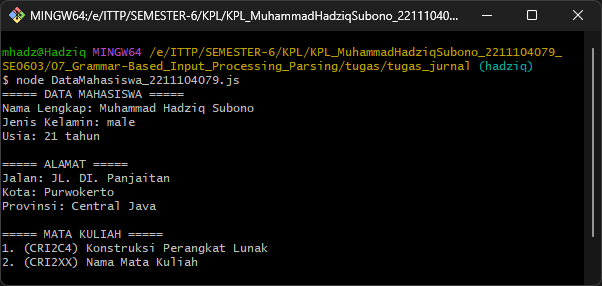
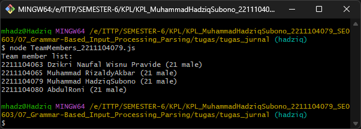
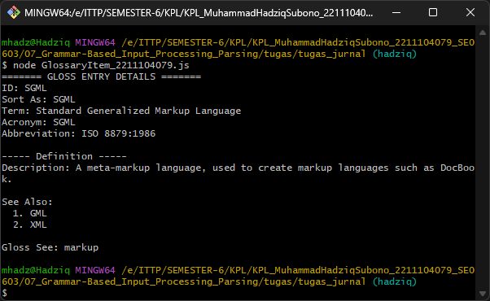
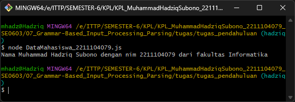
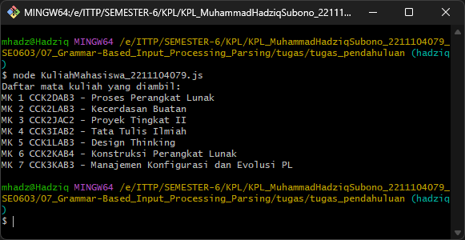

## Identitas Mahasiswa
- **Nama:** Muhammad Hadziq Subono  
- **NIM:** 2211104079  
- **Kelas:** SE06-C 

# Laporan Tugas Jurnal Modul 7
# 1. Source Code
## DataMahasiswa_2211104079.js

```javascript
const fs = require('fs');

class DataMahasiswa_2211104079 {
    constructor() {
        this.data = null;
    }

    ReadJSON() {
        try {
            // Membaca file JSON
            const rawData = fs.readFileSync('./jurnal7_1_2211104079.json');
            
            // Parsing data JSON menjadi object
            this.data = JSON.parse(rawData);
            
            // Menampilkan hasil deserialisasi
            console.log("===== DATA MAHASISWA =====");
            console.log(`Nama Lengkap: ${this.data.firstName} ${this.data.lastName}`);
            console.log(`Jenis Kelamin: ${this.data.gender}`);
            console.log(`Usia: ${this.data.age} tahun`);
            
            console.log("\n===== ALAMAT =====");
            console.log(`Jalan: ${this.data.address.streetAddress}`);
            console.log(`Kota: ${this.data.address.city}`);
            console.log(`Provinsi: ${this.data.address.state}`);
            
            console.log("\n===== MATA KULIAH =====");
            this.data.courses.forEach((course, index) => {
                console.log(`${index + 1}. (${course.code}) ${course.name}`);
            });
            
            return this.data;
        } catch (error) {
            console.error("Terjadi kesalahan saat membaca file JSON:", error.message);
            return null;
        }
    }
}

// Contoh penggunaan
const dataMahasiswa = new DataMahasiswa_2211104079();
dataMahasiswa.ReadJSON();

module.exports = DataMahasiswa_2211104079;
```

## TeamMembers_2211104079.js
```javascript
const fs = require('fs');

class TeamMembers_2211104079 {
    constructor() {
        this.data = null;
    }

    ReadJSON() {
        try {
            // Membaca file JSON
            const rawData = fs.readFileSync('./jurnal7_2_2211104079.json');
            
            // Parsing data JSON menjadi object
            this.data = JSON.parse(rawData);
            
            // Menampilkan hasil deserialisasi dengan format yang diminta
            console.log("Team member list:");
            
            // Loop melalui setiap anggota tim
            this.data.members.forEach(member => {
                console.log(`${member.nim} ${member.firstName}${member.lastName} (${member.age} ${member.gender})`);
            });
            
            return this.data;
        } catch (error) {
            console.error("Terjadi kesalahan saat membaca file JSON:", error.message);
            return null;
        }
    }
}

// Contoh penggunaan
const teamMembers = new TeamMembers_2211104079();
teamMembers.ReadJSON();

module.exports = TeamMembers_2211104079;
```

## GlossaryItem_2211104079.js
```javascript
const fs = require('fs');

class GlossaryItem_2211104079 {
    constructor() {
        this.data = null;
    }

    ReadJSON() {
        try {
            // Membaca file JSON
            const rawData = fs.readFileSync('./jurnal7_3_2211104079.json');
            
            // Parsing data JSON menjadi object
            this.data = JSON.parse(rawData);
            
            // Mengambil bagian GlossEntry saja
            const glossEntry = this.data.glossary.GlossDiv.GlossList.GlossEntry;
            
            // Menampilkan hasil deserialisasi dari GlossEntry
            console.log("======= GLOSS ENTRY DETAILS =======");
            console.log(`ID: ${glossEntry.ID}`);
            console.log(`Sort As: ${glossEntry.SortAs}`);
            console.log(`Term: ${glossEntry.GlossTerm}`);
            console.log(`Acronym: ${glossEntry.Acronym}`);
            console.log(`Abbreviation: ${glossEntry.Abbrev}`);
            
            console.log("\n----- Definition -----");
            console.log(`Description: ${glossEntry.GlossDef.para}`);
            
            console.log("\nSee Also:");
            glossEntry.GlossDef.GlossSeeAlso.forEach((item, index) => {
                console.log(`  ${index + 1}. ${item}`);
            });
            
            console.log(`\nGloss See: ${glossEntry.GlossSee}`);
            
            return glossEntry;
        } catch (error) {
            console.error("Terjadi kesalahan saat membaca file JSON:", error.message);
            return null;
        }
    }
}

// Contoh penggunaan
const glossaryItem = new GlossaryItem_2211104079();
glossaryItem.ReadJSON();

module.exports = GlossaryItem_2211104079;
```

# 2. Output
## DataMahasiswa_2211104079.js

## TeamMembers_2211104079.js

## GlossaryItem_2211104079.js



# 3. Penjelasan
# DataMahasiswa_2211104079.js
    File ini mengimplementasikan class untuk membaca dan memproses data mahasiswa dari file JSON. Di dalamnya terdapat konstruktor yang menginisialisasi variabel data dan method ReadJSON() yang melakukan proses utama. Method ReadJSON() bekerja dengan membaca file JSON menggunakan modul fs, kemudian mengubahnya menjadi objek JavaScript dengan JSON.parse(). Setelah berhasil melakukan parsing, program menampilkan informasi mahasiswa secara terstruktur dengan membagi bagian-bagian seperti data mahasiswa (nama, jenis kelamin, usia), alamat (jalan, kota, provinsi), dan daftar mata kuliah yang diambil. Class ini juga dilengkapi dengan penanganan error untuk mencegah program berhenti jika terjadi kesalahan saat membaca atau parsing file. Code ini juga menampilkan contoh penggunaan class dan mengekspornya dengan module.exports agar dapat digunakan di file lain.

# TeamMembers_2211104079.js
    Source code ini berisi implementasi class untuk memproses dan menampilkan daftar anggota tim yang diambil dari file JSON. Class TeamMembers_2211104079 menggunakan modul fs untuk membaca file JSON dan memiliki method ReadJSON() yang menjalankan proses inti. Setelah melakukan parsing data, program menampilkan daftar anggota tim dengan format khusus yang diminta: "nim nama (usia gender)" untuk setiap anggota. Implementasi menggunakan metode forEach untuk mengiterasi setiap anggota dalam array members dan menampilkan informasinya sesuai format. Code ini juga dilengkapi dengan penanganan kesalahan yang menampilkan pesan error jika terjadi masalah saat membaca atau memproses file. Class ini dibuat agar dapat digunakan langsung dengan contoh instantiasi di bagian akhir dan juga dapat diimport oleh file JavaScript lain berkat penggunaan module.exports.

# GlossaryItem_2211104079.js
    File ini berisi class yang dirancang untuk memproses struktur JSON yang lebih kompleks dan bersarang. Program ini membaca file glossary JSON dan secara khusus mengekstrak dan menampilkan informasi dari bagian GlossEntry. Setelah melakukan parsing file, program menelusuri struktur JSON bersarang dengan mengakses properti bertingkat seperti glossary.GlossDiv.GlossList.GlossEntry. Output ditampilkan dalam format yang terstruktur dan mudah dibaca, menampilkan informasi seperti ID, SortAs, GlossTerm, Acronym, dan Abbrev. Class ini juga menampilkan definisi dan referensi terkait dari GlossEntry, termasuk daftar "GlossSeeAlso" menggunakan forEach untuk iterasi array. Seperti class lainnya, program ini menangani potensi error dan memberikan pesan yang informatif jika terjadi masalah. Ini merupakan contoh bagaimana navigasi dan ekstraksi data dari struktur JSON yang kompleks dapat dilakukan menggunakan JavaScript.
---

# Laporan Tugas Pendahuluan Modul 7
# 1. Source Code
## DataMahasiswa_2211104079.js

```javascript
const fs = require('fs');

class DataMahasiswa_2211104079 {
    constructor() {
        this.data = null;
    }

    ReadJSON() {
        try {
            // Membaca file JSON
            const rawData = fs.readFileSync('./tp7_1_2211104079.json');
            
            // Parsing data JSON menjadi object
            this.data = JSON.parse(rawData);
            
            // Menampilkan hasil deserialisasi dengan format yang diminta
            console.log(`Nama ${this.data.nama.depan} ${this.data.nama.belakang} dengan nim ${this.data.nim} dari fakultas ${this.data.fakultas}`);
            
            return this.data;
        } catch (error) {
            console.error("Terjadi kesalahan saat membaca file JSON:", error.message);
            return null;
        }
    }
}

// Contoh penggunaan
const dataMahasiswa = new DataMahasiswa_2211104079();
dataMahasiswa.ReadJSON();

module.exports = DataMahasiswa_2211104079;
```

## KuliahMahasiswa_2211104079.js
```javascript
const fs = require('fs');

class KuliahMahasiswa_2211104079 {
    constructor() {
        this.data = null;
    }

    ReadJSON() {
        try {
            // Membaca file JSON
            const rawData = fs.readFileSync('./tp7_2_2211104079.json');
            
            // Parsing data JSON menjadi object
            this.data = JSON.parse(rawData);
            
            // Menampilkan hasil deserialisasi dengan format yang diminta
            console.log("Daftar mata kuliah yang diambil:");
            
            // Loop melalui setiap mata kuliah
            this.data.courses.forEach((course, index) => {
                console.log(`MK ${index + 1} ${course.code} - ${course.name}`);
            });
            
            return this.data;
        } catch (error) {
            console.error("Terjadi kesalahan saat membaca file JSON:", error.message);
            return null;
        }
    }
}

// Contoh penggunaan
const kuliahMahasiswa = new KuliahMahasiswa_2211104079();
kuliahMahasiswa.ReadJSON();

module.exports = KuliahMahasiswa_2211104079;
```

# 2. Output
## DataMahasiswa_2211104079.js

## KuliahMahasiswa_2211104079.js


# 3. Penjelasan
# DataMahasiswa_2211104079.js
    File ini mengimplementasikan sebuah class JavaScript yang dirancang untuk membaca dan memproses data mahasiswa dari file JSON dengan struktur yang lebih sederhana. Class DataMahasiswa_2211104079 memiliki konstruktor yang menginisialisasi variabel data dan method ReadJSON() sebagai fungsi utamanya. Method ini menggunakan modul fs untuk membaca file tp7_1_2211104079.json, kemudian memproses data tersebut dengan JSON.parse() untuk mengubahnya menjadi objek JavaScript. Setelah berhasil melakukan parsing, program menampilkan informasi mahasiswa dalam format kalimat "Nama [nama depan] [nama belakang] dengan nim [nim] dari fakultas [fakultas]". Implementasi ini juga menangani kemungkinan error yang mungkin terjadi saat membaca atau parsing file dengan blok try-catch. File ini juga menyertakan contoh penggunaan class dengan menginstansiasi objek dan memanggil method ReadJSON(), serta mengekspor class tersebut dengan module.exports agar bisa digunakan di file JavaScript lainnya.

# KuliahMahasiswa_2211104079.js
    Source code ini berisi class JavaScript yang berfungsi untuk membaca dan menampilkan daftar mata kuliah dari file JSON. KuliahMahasiswa_2211104079 class mengandalkan modul fs untuk operasi file dan memiliki method ReadJSON() yang membaca file tp7_2_2211104079.json. Setelah berhasil mengonversi data JSON menjadi objek JavaScript, program menampilkan daftar mata kuliah dengan format "MK [nomor] [kode] - [nama]". Implementasi menggunakan metode forEach untuk mengiterasi melalui array courses dan menampilkan setiap mata kuliah dengan nomor urut yang dihasilkan dari nilai index+1. Penanganan error juga diimplementasikan untuk menangani kasus ketika file tidak ditemukan atau format JSON tidak valid. Class ini dibuat dengan memperhatikan prinsip modularitas, dimana instantiasi objek diberikan sebagai contoh penggunaan dan ekspornya memungkinkan class ini untuk digunakan kembali di file JavaScript lainnya. Struktur code yang tertata dengan baik memudahkan pembacaan dan pemeliharaan kode di masa mendatang.