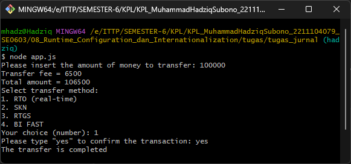

## Identitas Mahasiswa
- **Nama:** Muhammad Hadziq Subono  
- **NIM:** 2211104079  
- **Kelas:** SE06-C 

# Laporan Tugas Jurnal Modul 8
# 1. Source Code
## app.js

```javascript
const readline = require('readline');
const BankTransferConfig = require('./bankTransferConfig');

const rl = readline.createInterface({
    input: process.stdin,
    output: process.stdout
});

const config = new BankTransferConfig().config;

function ask(question) {
    return new Promise(resolve => rl.question(question, resolve));
}

async function main() {
    const lang = config.lang;
    const threshold = config.transfer.threshold;
    const lowFee = config.transfer.low_fee;
    const highFee = config.transfer.high_fee;
    const methods = config.methods;
    const confirmationText = config.confirmation;

    // 1. Input nominal uang
    const moneyInput = await ask(
        lang === 'en' 
            ? 'Please insert the amount of money to transfer: ' 
            : 'Masukkan jumlah uang yang akan di-transfer: '
    );

    const amount = parseInt(moneyInput);
    const fee = amount <= threshold ? lowFee : highFee;
    const total = amount + fee;

    // 2. Tampilkan biaya transfer
    if (lang === 'en') {
        console.log(`Transfer fee = ${fee}`);
        console.log(`Total amount = ${total}`);
    } else {
        console.log(`Biaya transfer = ${fee}`);
        console.log(`Total biaya = ${total}`);
    }

    // 3. Pilih metode transfer
    console.log(lang === 'en' ? 'Select transfer method:' : 'Pilih metode transfer:');
    methods.forEach((method, index) => {
        console.log(`${index + 1}. ${method}`);
    });

    await ask(lang === 'en' ? 'Your choice (number): ' : 'Pilih nomor metode: ');

    // 4. Konfirmasi transaksi
    const confirmInput = await ask(
        lang === 'en' 
            ? `Please type "${confirmationText.en}" to confirm the transaction: `
            : `Ketik "${confirmationText.id}" untuk mengkonfirmasi transaksi: `
    );

    const validConfirm = lang === 'en' ? confirmationText.en : confirmationText.id;

    if (confirmInput === validConfirm) {
        console.log(lang === 'en' ? 'The transfer is completed' : 'Proses transfer berhasil');
    } else {
        console.log(lang === 'en' ? 'Transfer is cancelled' : 'Transfer dibatalkan');
    }

    rl.close();
}

main();
```

# 2. Output
## app.js



# 3. Penjelasan
# app.js
File app.js merupakan program utama untuk aplikasi transfer bank sederhana berbasis console. Aplikasi ini menggunakan module readline untuk interaksi dengan pengguna dan mengimpor konfigurasi dari file bankTransferConfig.js. Program ini mengimplementasikan fungsi asinkron dengan Promise dan async/await untuk menangani input dari pengguna secara berurutan. Alur program dimulai dengan pengambilan konfigurasi seperti bahasa, threshold transfer, biaya transfer, metode pembayaran, dan teks konfirmasi dari file konfigurasi. Selanjutnya, program menjalankan empat langkah utama: meminta input nominal uang transfer, menampilkan biaya transfer yang dihitung berdasarkan nominal (rendah atau tinggi tergantung threshold), menampilkan pilihan metode transfer, dan meminta konfirmasi transaksi dari pengguna. Program ini juga mendukung dua bahasa (Indonesia dan Inggris) yang ditentukan dari konfigurasi, dimana semua teks output dan prompt disesuaikan dengan bahasa yang dipilih. Transaksi akan berhasil jika pengguna memasukkan kata konfirmasi yang tepat dan dibatalkan jika tidak sesuai. Struktur code yang modular dan penggunaan Promise membuat alur program mudah dipahami dan menjaga kode tetap terorganisir dengan baik.

---

# Laporan Tugas Pendahuluan Modul 8
# 1. Source Code
## app.js

```javascript
const fs = require('fs');
const readline = require('readline');
const path = require('path');

// Class CovidConfig
class CovidConfig {
  constructor() {
    this.configPath = path.join(__dirname, 'covid_config.json');
    this.defaultConfig = {
      satuan_suhu: 'celcius',
      batas_hari_deman: 14,
      pesan_ditolak: 'Anda tidak diperbolehkan masuk ke dalam gedung ini',
      pesan_diterima: 'Anda dipersilahkan untuk masuk ke dalam gedung ini'
    };

    this.config = this.loadConfig();
  }

  loadConfig() {
    try {
      if (fs.existsSync(this.configPath)) {
        const data = fs.readFileSync(this.configPath, 'utf8');
        return JSON.parse(data);
      } else {
        return this.defaultConfig;
      }
    } catch (err) {
      console.error('Gagal membaca konfigurasi, menggunakan default.');
      return this.defaultConfig;
    }
  }

  saveConfig() {
    fs.writeFileSync(this.configPath, JSON.stringify(this.config, null, 2));
  }

  ubahSatuan() {
    this.config.satuan_suhu = this.config.satuan_suhu === 'celcius' ? 'fahrenheit' : 'celcius';
    this.saveConfig();
    console.log(`Satuan suhu berhasil diubah menjadi ${this.config.satuan_suhu}`);
  }
}

// Fungsi untuk input
const rl = readline.createInterface({
  input: process.stdin,
  output: process.stdout
});

function askQuestion(query) {
  return new Promise(resolve => rl.question(query, resolve));
}

// Program utama
(async function main() {
  const configHandler = new CovidConfig();
  const config = configHandler.config;

  // Contoh: ubah satuan suhu jika perlu
  // configHandler.ubahSatuan(); // Uncomment baris ini jika ingin mengubah satuan suhu

  const suhuInput = await askQuestion(`Berapa suhu badan anda saat ini? Dalam nilai ${config.satuan_suhu}: `);
  const suhu = parseFloat(suhuInput);

  const hariInput = await askQuestion('Berapa hari yang lalu (perkiraan) anda terakhir memiliki gejala demam? ');
  const hariDemam = parseInt(hariInput);

  rl.close();

  let suhuNormal = false;
  if (config.satuan_suhu === 'celcius') {
    suhuNormal = suhu >= 36.5 && suhu <= 37.5;
  } else if (config.satuan_suhu === 'fahrenheit') {
    suhuNormal = suhu >= 97.7 && suhu <= 99.5;
  }

  const hariCukup = hariDemam < config.batas_hari_deman;

  if (suhuNormal && hariCukup) {
    console.log(config.pesan_diterima);
  } else {
    console.log(config.pesan_ditolak);
  }
})();

```

# 2. Output
## DataMahasiswa_2211104079.js


# 3. Penjelasan
# app.js
File app.js ini merupakan aplikasi screening COVID-19 yang mengimplementasikan solusi lengkap dengan kelas konfigurasi terintegrasi. Program ini menggunakan modul fs untuk operasi file, readline untuk interaksi pengguna, dan path untuk manajemen lokasi file. Komponen utama dalam file ini adalah class CovidConfig yang bertanggung jawab untuk mengelola konfigurasi aplikasi. Class ini menyediakan fungsionalitas untuk memuat konfigurasi dari file JSON, menyimpan konfigurasi ke file, dan mengubah satuan suhu antara Celsius dan Fahrenheit. Program utama diimplementasikan sebagai Immediately Invoked Function Expression (IIFE) asinkron yang menggunakan Promise untuk manajemen input pengguna melalui fungsi askQuestion(). Alur program meliputi pengecekan suhu tubuh dan riwayat demam pengguna, kemudian melakukan validasi berdasarkan parameter dari konfigurasi. Validasi mempertimbangkan rentang suhu normal (yang berbeda untuk Celsius dan Fahrenheit) dan jumlah hari sejak demam terakhir terjadi. Hasil evaluasi ditampilkan dengan pesan yang sesuai dari konfigurasi, memberikan informasi apakah pengguna diperbolehkan masuk ke gedung atau tidak. Kode ini juga mendemonstrasikan praktik pengembangan yang baik dengan penggunaan manajemen error dan konfigurasi default jika file konfigurasi tidak tersedia.