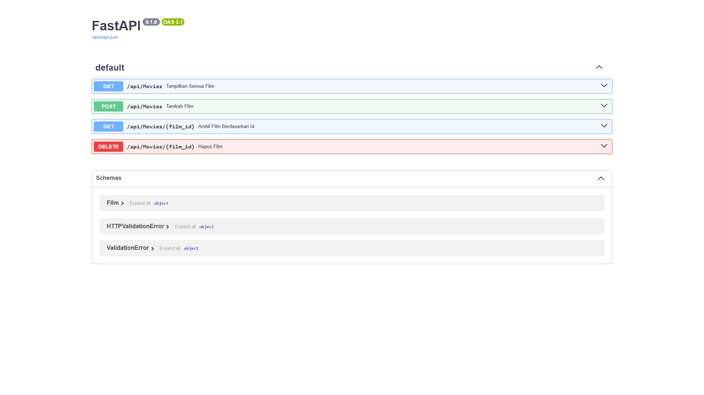
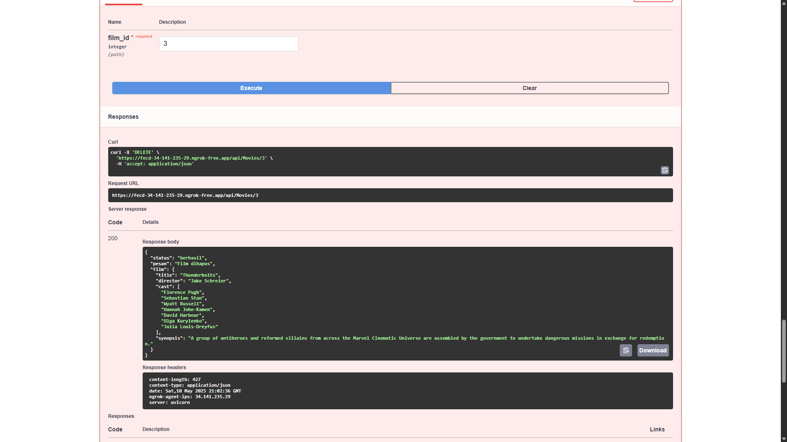
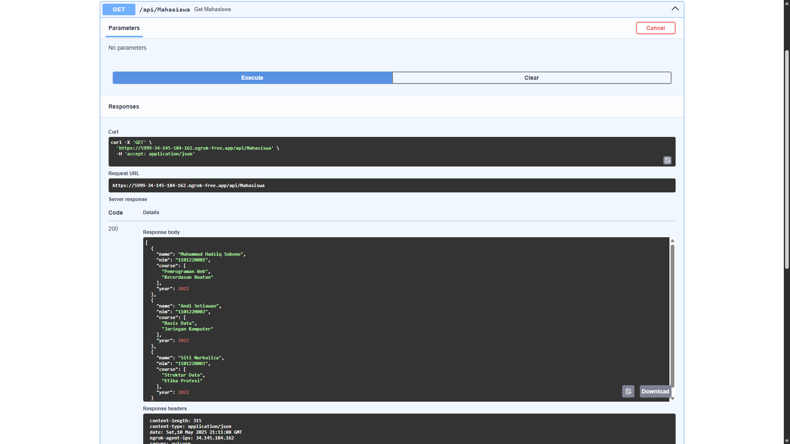
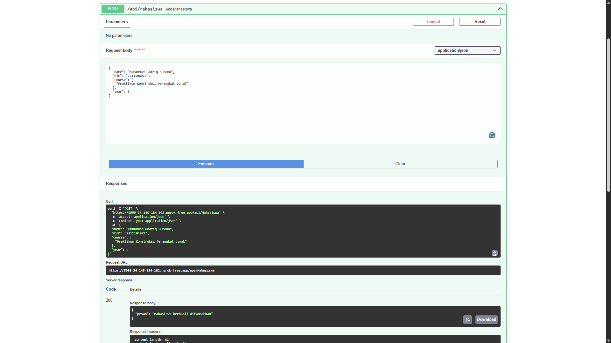

# Laporan Praktikum Web API

## Identitas Mahasiswa
- **Nama:** Muhammad Hadziq Subono  
- **NIM:** 2211104079  
- **Kelas:** SE06-C  

---

## Laporan Tugas Jurnal Pertemuan 8 – Movie API

### Source Code

```python
from fastapi import FastAPI, HTTPException
from pydantic import BaseModel
from typing import List
import nest_asyncio
from pyngrok import ngrok, conf
import uvicorn

app = FastAPI()

conf.get_default().auth_token = "ISI_DENGAN_AUTH_TOKEN_KAMU"

class Film(BaseModel):
    title: str
    director: str
    cast: List[str]
    synopsis: str

film_storage = [
    {
        "title": "Inception",
        "director": "Christopher Nolan",
        "cast": ["Leonardo DiCaprio", "Joseph Gordon-Levitt", "Ellen Page"],
        "synopsis": "Seorang pencuri yang memiliki kemampuan untuk masuk ke dalam mimpi orang lain ditugaskan untuk menanamkan ide ke dalam pikiran targetnya."
    },
    {
        "title": "Interstellar",
        "director": "Christopher Nolan",
        "cast": ["Matthew McConaughey", "Anne Hathaway", "Jessica Chastain"],
        "synopsis": "Sebuah tim penjelajah ruang angkasa melakukan perjalanan melalui wormhole untuk mencari planet baru yang layak huni bagi umat manusia."
    },
    {
        "title": "Parasite",
        "director": "Bong Joon-ho",
        "cast": ["Song Kang-ho", "Lee Sun-kyun", "Cho Yeo-jeong"],
        "synopsis": "Keluarga miskin di Korea menyusup ke kehidupan keluarga kaya, mengakibatkan serangkaian kejadian tak terduga yang penuh ketegangan dan satire sosial."
    },
]

@app.get("/api/Movies")
def tampilkan_semua_film():
    return film_storage

@app.get("/api/Movies/{film_id}")
def ambil_film_berdasarkan_id(film_id: int):
    if 0 <= film_id < len(film_storage):
        return film_storage[film_id]
    return {"status": "gagal", "pesan": "Film tidak ditemukan"}

@app.post("/api/Movies")
def tambah_film(film: Film):
    film_storage.append(film.dict())
    return {"status": "berhasil", "pesan": "Film berhasil ditambahkan"}

@app.delete("/api/Movies/{film_id}")
def hapus_film(film_id: int):
    if 0 <= film_id < len(film_storage):
        data_dihapus = film_storage.pop(film_id)
        return {"status": "berhasil", "pesan": "Film dihapus", "film": data_dihapus}
    return {"status": "gagal", "pesan": "Film tidak ditemukan"}

nest_asyncio.apply()
tunnel_url = ngrok.connect(8000)
print("🎥 Swagger UI:", tunnel_url.public_url + "/docs")
print("🎥 API Endpoint:", tunnel_url.public_url)

uvicorn.run(app, port=8000)
```
---

### Output berupa Screenshot

1. **UI SWAGGER**
   

2. **GET /api/mahasiswa Tampilkan Semua Film**
   

3. **POST /api/mahasiswa Tambah Film**
   

4. **GET /api/mahasiswa/{index} Ambil Film Berdasarkan ID**
   

5. **DELETE /api/mahasiswa/ Hapus Film**
   

---

### Penjelasan
Program ini membuat API untuk data film menggunakan FastAPI. Terdapat 3 endpoint utama untuk menampilkan, menambah, dan menghapus film. Data film disimpan di list Python, bukan di database. Ngrok digunakan agar API bisa diakses dari internet.

---

## Laporan Tugas Jurnal Pertemuan 9 – Mahasiswa API

### Source Code

```python
from fastapi import FastAPI, HTTPException
from pydantic import BaseModel, Field
from typing import List
import nest_asyncio
from pyngrok import ngrok, conf
import uvicorn

app = FastAPI()

conf.get_default().auth_token = "ISI_DENGAN_AUTH_TOKEN_KAMU"

class Mahasiswa(BaseModel):
    nama: str = Field(..., min_length=1)
    nim: str = Field(..., min_length=8)

mahasiswa_storage: List[dict] = [
    {"nama": "Muhammad Hadziq Subono", "nim": "2211104079"},
    {"nama": "LeBron James", "nim": "1302000001"},
    {"nama": "Stephen Curry", "nim": "1302000002"}
]

@app.get("/api/mahasiswa")
def get_all_mahasiswa():
    return mahasiswa_storage

@app.get("/api/mahasiswa/{index}")
def get_mahasiswa(index: int):
    if 0 <= index < len(mahasiswa_storage):
        return mahasiswa_storage[index]
    raise HTTPException(status_code=404, detail="Mahasiswa tidak ditemukan")

@app.post("/api/mahasiswa")
def add_mahasiswa(mhs: Mahasiswa):
    mahasiswa_storage.append(mhs.dict())
    return {"status": "berhasil", "pesan": "Mahasiswa berhasil ditambahkan"}

@app.delete("/api/mahasiswa/{index}")
def delete_mahasiswa(index: int):
    if 0 <= index < len(mahasiswa_storage):
        deleted = mahasiswa_storage.pop(index)
        return {"status": "berhasil", "pesan": "Mahasiswa dihapus", "data": deleted}
    raise HTTPException(status_code=404, detail="Mahasiswa tidak ditemukan")

nest_asyncio.apply()
tunnel_url = ngrok.connect(8000)
print("🚀 Swagger UI:", tunnel_url.public_url + "/docs")
print("🚀 Endpoint API:", tunnel_url.public_url)

uvicorn.run(app, port=8000)
```
---

### Output berupa Screenshot

1. **UI SWAGGER**
   

2. **GET /api/mahasiswa GET Mahasiswa**
   

3. **POST /api/mahasiswa Add Mahasiswa**
   

4. **GET /api/mahasiswa/{index} Get Mahasiswa by ID**
   

5. **DELETE /api/mahasiswa/ Delete Mahasiswa**
   

---

### Penjelasan
API ini mengelola data mahasiswa dengan endpoint `GET`, `POST`, dan `DELETE`. Data disimpan dalam list Python secara statis. Setiap mahasiswa memiliki nama dan NIM. Endpoint dilindungi dengan pengecekan batas index dan format data divalidasi menggunakan Pydantic.

---