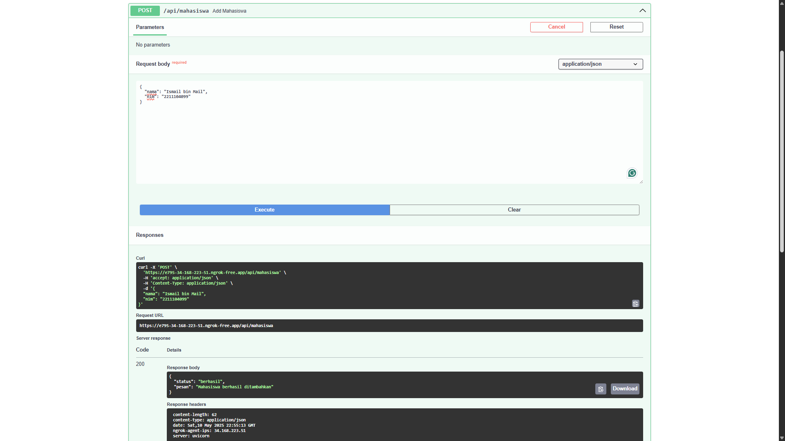
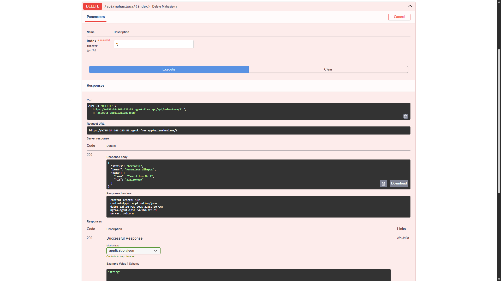

## Identitas Mahasiswa
- **Nama:** Muhammad Hadziq Subono  
- **NIM:** 2211104079  
- **Kelas:** SE06-C  

## Laporan Tugas Jurnal Pertemuan 9

### Source Code

```python
from fastapi import FastAPI, HTTPException
from pydantic import BaseModel, Field
from typing import List
import nest_asyncio
from pyngrok import ngrok, conf
import uvicorn

app = FastAPI()

conf.get_default().auth_token = "ISI_DENGAN_AUTH_TOKEN_KAMU"

class Mahasiswa(BaseModel):
    nama: str = Field(..., min_length=1)
    nim: str = Field(..., min_length=8)

mahasiswa_storage: List[dict] = [
    {"nama": "Muhammad Hadziq Subono", "nim": "2211104079"},
    {"nama": "LeBron James", "nim": "1302000001"},
    {"nama": "Stephen Curry", "nim": "1302000002"}
]

@app.get("/api/mahasiswa")
def get_all_mahasiswa():
    return mahasiswa_storage

@app.get("/api/mahasiswa/{index}")
def get_mahasiswa(index: int):
    if 0 <= index < len(mahasiswa_storage):
        return mahasiswa_storage[index]
    raise HTTPException(status_code=404, detail="Mahasiswa tidak ditemukan")

@app.post("/api/mahasiswa")
def add_mahasiswa(mhs: Mahasiswa):
    mahasiswa_storage.append(mhs.dict())
    return {"status": "berhasil", "pesan": "Mahasiswa berhasil ditambahkan"}

@app.delete("/api/mahasiswa/{index}")
def delete_mahasiswa(index: int):
    if 0 <= index < len(mahasiswa_storage):
        deleted = mahasiswa_storage.pop(index)
        return {"status": "berhasil", "pesan": "Mahasiswa dihapus", "data": deleted}
    raise HTTPException(status_code=404, detail="Mahasiswa tidak ditemukan")

nest_asyncio.apply()
tunnel_url = ngrok.connect(8000)
print("🚀 Swagger UI:", tunnel_url.public_url + "/docs")
print("🚀 Endpoint API:", tunnel_url.public_url)

uvicorn.run(app, port=8000)
```

---

### Output berupa Screenshot

1. **UI SWAGGER**
   

2. **GET /api/mahasiswa Get All Mahasiswa**
   

3. **POST /api/mahasiswa Add Mahasiswa**
   

4. **GET /api/mahasiswa/{index}**
   

5. **DELETE /api/mahasiswa/ Delete Mahasiswa**
   

---

### Penjelasan

Program Web API ini dibuat menggunakan framework **FastAPI** untuk membuat layanan RESTful sederhana tanpa menggunakan database. Berikut penjelasan tiap bagian kode:

- **Import Library**: 
  - `FastAPI` dan `HTTPException` digunakan untuk membuat API dan menangani error.
  - `BaseModel` dan `Field` dari Pydantic digunakan untuk mendefinisikan struktur data mahasiswa.
  - `nest_asyncio` dan `ngrok` digunakan agar server FastAPI bisa berjalan di Jupyter Notebook dan dapat diakses secara publik.

- **Deklarasi Aplikasi**: `app = FastAPI()` membuat instance utama aplikasi.

- **Model `Mahasiswa`**: 
  - Merupakan blueprint data mahasiswa, terdiri dari `nama` dan `nim` yang wajib diisi.
  - Menggunakan validasi minimal panjang teks dengan `min_length`.

- **`mahasiswa_storage`**: 
  - Sebuah list Python biasa yang menyimpan data mahasiswa secara statis.
  - Diawali dengan 3 data awal, termasuk nama sendiri sebagai urutan pertama.

- **Endpoint `/api/mahasiswa`** (GET): 
  - Mengembalikan seluruh list mahasiswa.

- **Endpoint `/api/mahasiswa/{index}`** (GET):
  - Mengembalikan satu data mahasiswa berdasarkan index.
  - Menggunakan pengecekan batas index agar tidak terjadi error.

- **Endpoint `/api/mahasiswa`** (POST):
  - Menambahkan data mahasiswa baru ke list.
  - Data dikonversi ke dictionary dan disimpan.

- **Endpoint `/api/mahasiswa/{index}`** (DELETE):
  - Menghapus data mahasiswa berdasarkan index.

- **Ngrok dan Uvicorn**:
  - `ngrok.connect(8000)` membuka tunnel ke internet.
  - `uvicorn.run(...)` menjalankan server FastAPI di port 8000.