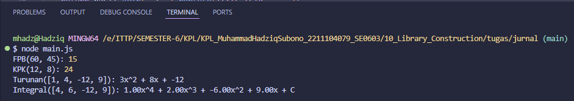
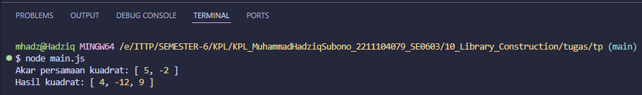

# Laporan Praktikum Web API

## Identitas Mahasiswa
- **Nama:** Muhammad Hadziq Subono  
- **NIM:** 2211104079  
- **Kelas:** SE06-C  

---

# Tugas Jurnal Modul 10

## Source Code

### File: matematikaLibraries.js
```javascript
function FPB(a, b) {
    while (b !== 0) {
        [a, b] = [b, a % b];
    }
    return Math.abs(a);
}

function KPK(a, b) {
    return Math.abs(a * b) / FPB(a, b);
}

function Turunan(persamaan) {
    const turunan = [];
    const n = persamaan.length;
    for (let i = 0; i < n - 1; i++) {
        const coef = persamaan[i] * (n - i - 1);
        if (coef === 0) continue;
        const pangkat = n - i - 2;
        const str = pangkat === 0 ? `${coef}` :
                    pangkat === 1 ? `${coef}x` : `${coef}x^${pangkat}`;
        turunan.push(str);
    }
    return turunan.join(' + ').replace(/\+\s-\s/g, '- ');
}

function Integral(persamaan) {
    const hasil = [];
    const n = persamaan.length;
    for (let i = 0; i < n; i++) {
        const pangkat = n - i;
        const coef = (persamaan[i] / pangkat).toFixed(2);
        const str = pangkat === 1 ? `${coef}x` : `${coef}x^${pangkat}`;
        hasil.push(str);
    }
    hasil.push('C');
    return hasil.join(' + ').replace(/\+\s-\s/g, '- ');
}

module.exports = { FPB, KPK, Turunan, Integral };
```

### File: main.js
```javascript
const { FPB, KPK, Turunan, Integral } = require('./matematikaLibraries');

console.log('FPB(60, 45):', FPB(60, 45));
console.log('KPK(12, 8):', KPK(12, 8));
console.log('Turunan([1, 4, -12, 9]):', Turunan([1, 4, -12, 9]));
console.log('Integral([4, 6, -12, 9]):', Integral([4, 6, -12, 9]));
```

## Output berupa Screenshot


## Penjelasan
Fungsi `FPB` menggunakan algoritma Euclidean untuk mencari faktor persekutuan terbesar. `KPK` dihitung dari hasil kali dibagi FPB. `Turunan` menghitung turunan dari polinomial dengan menurunkan setiap suku, dan `Integral` melakukan proses kebalikan, dengan menambahkan pangkat dan membagi koefisien.

---

# Tugas Pendahuluan Modul 10

## Source Code

### File: aljabarLibraries.js
```javascript
function AkarPersamaanKuadrat([a, b, c]) {
    const diskriminan = b * b - 4 * a * c;
    if (diskriminan < 0) return ["Akar imajiner"];
    const akar1 = (-b + Math.sqrt(diskriminan)) / (2 * a);
    const akar2 = (-b - Math.sqrt(diskriminan)) / (2 * a);
    return [akar1, akar2];
}

function HasilKuadrat([a, b]) {
    const a2 = a * a;
    const ab2 = 2 * a * b;
    const b2 = b * b;
    return [a2, ab2, b2];
}

module.exports = { AkarPersamaanKuadrat, HasilKuadrat };
```

### File: main.js
```javascript
const { AkarPersamaanKuadrat, HasilKuadrat } = require('./aljabarLibraries');

const akar = AkarPersamaanKuadrat([1, -3, -10]);
console.log('Akar persamaan kuadrat:', akar);

const kuadrat = HasilKuadrat([2, -3]);
console.log('Hasil kuadrat:', kuadrat);
```

## Output berupa Screenshot


## Penjelasan
`AkarPersamaanKuadrat` menggunakan rumus kuadrat untuk menghitung akar-akar dari persamaan kuadrat, dan menangani kasus diskriminan negatif. `HasilKuadrat` mengimplementasikan formula \((ax + b)^2 = a^2x^2 + 2abx + b^2\) untuk menghasilkan array koefisien hasil kuadrat dari persamaan linear.
