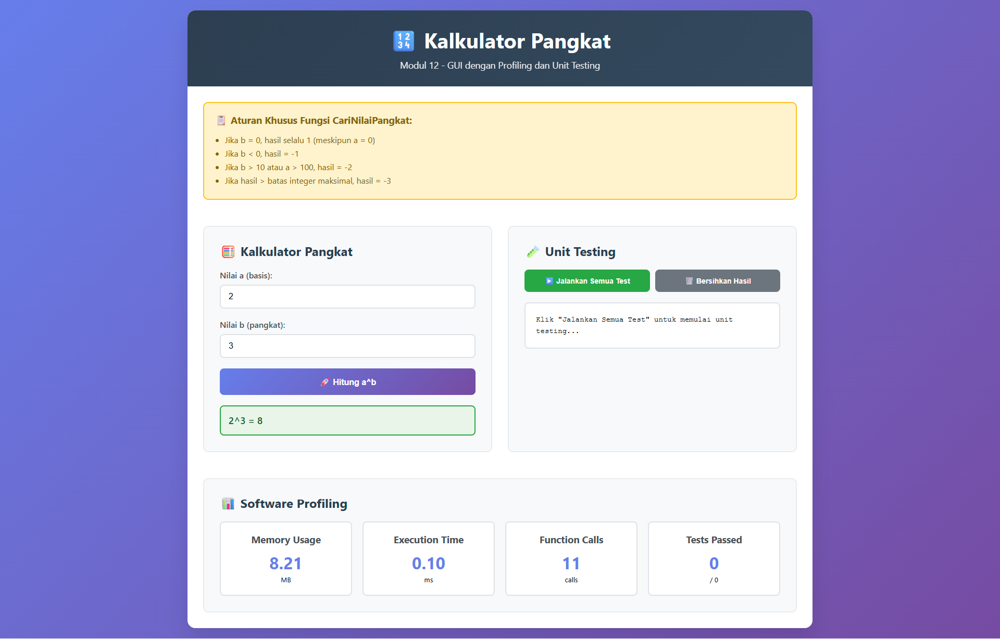

# Laporan Praktikum Web API

## Identitas Mahasiswa
- **Nama:** Muhammad Hadziq Subono  
- **NIM:** 2211104079  
- **Kelas:** SE06-C  

---

# Tugas Jurnal: Kalkulator Pangkat (Versi Web)

## Source Code

### File: script.js
```javascript
function CariNilaiPangkat(a, b) {
    if (b === 0) return 1;
    if (b < 0) return -1;
    if (b > 10 || a > 100) return -2;

    let result = 1;
    const MAX_INTEGER = 2147483647;

    for (let i = 0; i < b; i++) {
        if (result > MAX_INTEGER / a) return -3;
        result *= a;
    }
    return result;
}
```

### Fungsi Tambahan:
- Fungsi `calculatePower()` digunakan untuk mengambil input dari form dan memanggil `CariNilaiPangkat()`.
- Fungsi `runAllTests()` melakukan **unit testing lengkap** terhadap semua cabang kondisi (branch) dari fungsi `CariNilaiPangkat`.
- Profiling dan performa (jumlah panggilan fungsi, estimasi memory, dan execution time) ditampilkan secara real-time di halaman.

## Output berupa Screenshot


## Penjelasan

Aplikasi ini merupakan implementasi kalkulator pangkat berbasis web yang mensimulasikan GUI menggunakan HTML, CSS, dan JavaScript.

### Logika `CariNilaiPangkat(a, b)`:
- Jika `b == 0` maka hasil = 1
- Jika `b < 0` maka hasil = -1 (tidak valid)
- Jika `b > 10` atau `a > 100` maka hasil = -2
- Jika hasil melebihi batas integer (overflow), maka hasil = -3
- Selain kondisi di atas, nilai pangkat dihitung dengan iterasi.

### Fitur-fitur aplikasi:
- Antarmuka pengguna dengan input `a` dan `b`, tombol untuk menghitung.
- Validasi input dan pesan error sesuai kondisi.
- Profiling untuk waktu eksekusi, jumlah panggilan fungsi, dan simulasi penggunaan memori.
- Unit testing lengkap dengan 100% branch coverage.

Program ini dapat dijalankan di browser secara langsung dan menjadi alternatif dari aplikasi GUI desktop berbasis Windows Form.
