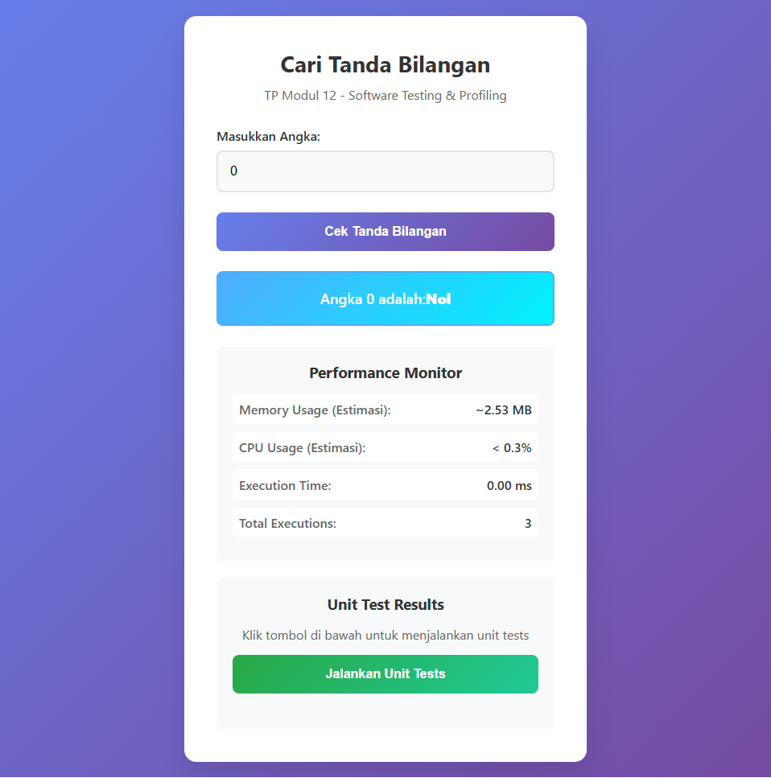

# Laporan Praktikum Web API

## Identitas Mahasiswa
- **Nama:** Muhammad Hadziq Subono  
- **NIM:** 2211104079  
- **Kelas:** SE06-C  

---

# Tugas Pendahuluan: Cari Tanda Bilangan (Versi Web)

## Source Code

### File: script.js
```javascript
function CariTandaBilangan(a) {
    if (a < 0) {
        return "Negatif";
    } else if (a > 0) {
        return "Positif";
    } else {
        return "Nol";
    }
}

function cariTandaBilangan() {
    const inputElement = document.getElementById('inputNumber');
    const outputElement = document.getElementById('output');

    if (inputElement.value === '') {
        outputElement.innerHTML = 'Silakan masukkan angka terlebih dahulu!';
        return;
    }

    const inputValue = parseInt(inputElement.value);

    if (isNaN(inputValue)) {
        outputElement.innerHTML = 'Input tidak valid! Masukkan angka yang benar.';
        return;
    }

    const result = CariTandaBilangan(inputValue);
    outputElement.innerHTML = `Angka ${inputValue} adalah: <strong>${result}</strong>`;
}
```

## Output berupa Screenshot


## Penjelasan

Program ini adalah versi web dari aplikasi untuk menentukan **tanda bilangan** berdasarkan nilai yang dimasukkan pengguna. Input dapat berupa angka positif, nol, maupun negatif.

### Fitur-fitur:
- Pengguna memasukkan angka ke dalam input.
- Program memanggil fungsi `CariTandaBilangan(a)` yang mengembalikan:
  - "Negatif" jika `a < 0`
  - "Nol" jika `a == 0`
  - "Positif" jika `a > 0`
- Hasil ditampilkan langsung ke pengguna di elemen `output`.
- Terdapat juga validasi input dan simulasi metrik penggunaan memori, CPU, dan waktu eksekusi.
- Unit testing disediakan dengan cakupan 100% untuk semua cabang kondisi.

Program ini membantu mahasiswa memahami pengkondisian dasar serta praktik membuat antarmuka web interaktif sebagai alternatif GUI desktop.
