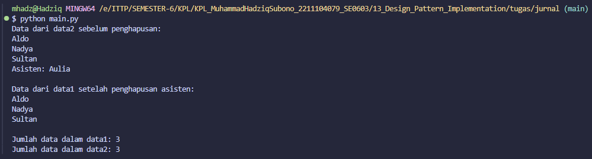

# Laporan Praktikum Design Pattern Singleton (Modul 13)

## Identitas Mahasiswa
- **Nama:** Muhammad Hadziq Subono  
- **NIM:** 2211104079  
- **Kelas:** SE06-C  

---

# Tugas Jurnal: Implementasi Design Pattern Singleton

## Source Code

### File: main.py
```python
class PusatDataSingleton:
    _instance = None

    def __init__(self):
        if not hasattr(self, 'DataTersimpan'):
            self.DataTersimpan = []

    @staticmethod
    def GetDataSingleton():
        if PusatDataSingleton._instance is None:
            PusatDataSingleton._instance = PusatDataSingleton()
        return PusatDataSingleton._instance

    def GetSemuaData(self):
        return self.DataTersimpan

    def PrintSemuaData(self):
        for data in self.DataTersimpan:
            print(data)

    def AddSebuahData(self, input):
        self.DataTersimpan.append(input)

    def HapusSebuahData(self, index):
        if 0 <= index < len(self.DataTersimpan):
            del self.DataTersimpan[index]
```

### Program Utama
```python
if __name__ == "__main__":
    data1 = PusatDataSingleton.GetDataSingleton()
    data2 = PusatDataSingleton.GetDataSingleton()

    data1.AddSebuahData("Aldo")
    data1.AddSebuahData("Nadya")
    data1.AddSebuahData("Sultan")
    data1.AddSebuahData("Asisten: Aulia")

    print("Data dari data2 sebelum penghapusan:")
    data2.PrintSemuaData()

    index_asisten = data2.GetSemuaData().index("Asisten: Aulia")
    data2.HapusSebuahData(index_asisten)

    print("\nData dari data1 setelah penghapusan asisten:")
    data1.PrintSemuaData()

    print("\nJumlah data dalam data1:", len(data1.GetSemuaData()))
    print("Jumlah data dalam data2:", len(data2.GetSemuaData()))
```

## Output berupa Screenshot
  
*(Gantilah dengan screenshot hasil run programmu)*

## Penjelasan

Aplikasi ini mengimplementasikan **design pattern Singleton** dengan membuat class `PusatDataSingleton` yang hanya dapat memiliki satu instance.

### Penjelasan Class:
- `DataTersimpan`: atribut bertipe `List[str]` untuk menyimpan data.
- `_instance`: properti static yang menyimpan satu-satunya instance dari singleton.
- `GetDataSingleton()`: mengembalikan instance yang sama setiap kali dipanggil.
- `AddSebuahData(input)`: menambahkan data ke list.
- `PrintSemuaData()`: mencetak semua elemen dalam list.
- `HapusSebuahData(index)`: menghapus data berdasarkan index.

### Penjelasan Program Utama:
- `data1` dan `data2` menunjuk ke objek singleton yang sama.
- Data ditambahkan lewat `data1`, lalu diperiksa dan dihapus lewat `data2`.
- Karena menggunakan Singleton, perubahan pada `data2` akan terlihat juga di `data1`.
- Akhirnya, jumlah data pada `data1` dan `data2` dicetak, dan hasilnya sama.

### Tujuan dan Pembuktian:
Dengan menjalankan kode di atas, kita membuktikan bahwa `data1` dan `data2` adalah referensi ke **objek yang sama**, sehingga setiap perubahan akan berlaku global dalam ruang lingkup aplikasi.

---

## Jawaban Teori Singleton

### 1. Dua Contoh Kondisi Penggunaan Singleton

**a. Koneksi Database**  
Singleton digunakan untuk memastikan hanya ada satu objek koneksi database yang aktif sepanjang aplikasi berjalan. Ini membantu menghemat resource dan menghindari konflik antar koneksi.

**b. Logger (Pencatat Log Aplikasi)**  
Sebuah sistem logging biasanya membutuhkan satu instance saja untuk mencatat semua aktivitas aplikasi. Singleton memastikan logger dapat diakses dari berbagai tempat tanpa membuat instance baru.

---

### 2. Langkah-langkah Mengimplementasikan Singleton

1. **Buat Konstruktor Privat**  
   Agar objek tidak bisa diinstansiasi dari luar kelas.

2. **Buat Variabel Statis Bertipe Kelas Sendiri**  
   Tempat menyimpan satu-satunya instance dari kelas tersebut.

3. **Buat Method Statis untuk Mengakses Instance**  
   Method ini akan mengembalikan instance yang telah dibuat. Jika belum ada, maka akan dibuat terlebih dahulu.

---

### 3. Kelebihan dan Kekurangan Singleton

**Kelebihan:**
- **Kontrol Akses Global ke Instance:** Memberikan satu titik akses global ke objek yang sama.
- **Menghemat Resource:** Hanya satu objek yang dibuat, sehingga lebih efisien dalam penggunaan memori dan CPU.
- **Konsistensi Status Objek:** Karena hanya ada satu instance, data tetap konsisten di seluruh aplikasi.

**Kekurangan:**
- **Sulit untuk Di-Unit Test:** Karena bergantung pada instance global, sulit untuk diuji secara terisolasi (mocking).
- **Menyebabkan Tight Coupling:** Komponen aplikasi menjadi terlalu bergantung pada instance tunggal tersebut.
- **Tidak Cocok untuk Multithreading Tanpa Modifikasi:** Jika tidak dikunci (thread-safe), bisa menimbulkan masalah saat digunakan di lingkungan multithread.