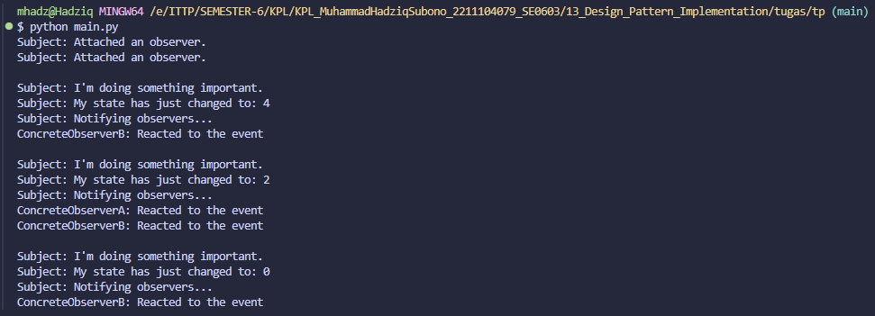

# Laporan Praktikum Design Pattern Observer (Modul 13)

## Identitas Mahasiswa
- **Nama:** Muhammad Hadziq Subono  
- **NIM:** 2211104079  
- **Kelas:** SE06-C  

---

## Tugas Praktikum: Implementasi Design Pattern Observer

### Source Code

#### File: main.py
```python
# Source code sudah diadaptasi dari Refactoring Guru (Python version)

from __future__ import annotations
from abc import ABC, abstractmethod
from random import randrange
from typing import List

class Subject(ABC):
    @abstractmethod
    def attach(self, observer: Observer) -> None:
        pass

    @abstractmethod
    def detach(self, observer: Observer) -> None:
        pass

    @abstractmethod
    def notify(self) -> None:
        pass

class ConcreteSubject(Subject):
    _state: int = None
    _observers: List[Observer] = []

    def attach(self, observer: Observer) -> None:
        print("Subject: Attached an observer.")
        self._observers.append(observer)

    def detach(self, observer: Observer) -> None:
        self._observers.remove(observer)

    def notify(self) -> None:
        print("Subject: Notifying observers...")
        for observer in self._observers:
            observer.update(self)

    def some_business_logic(self) -> None:
        print("\nSubject: I'm doing something important.")
        self._state = randrange(0, 10)
        print(f"Subject: My state has just changed to: {self._state}")
        self.notify()

class Observer(ABC):
    @abstractmethod
    def update(self, subject: Subject) -> None:
        pass

class ConcreteObserverA(Observer):
    def update(self, subject: Subject) -> None:
        if subject._state < 3:
            print("ConcreteObserverA: Reacted to the event")

class ConcreteObserverB(Observer):
    def update(self, subject: Subject) -> None:
        if subject._state == 0 or subject._state >= 2:
            print("ConcreteObserverB: Reacted to the event")

if __name__ == "__main__":
    subject = ConcreteSubject()

    observer_a = ConcreteObserverA()
    subject.attach(observer_a)

    observer_b = ConcreteObserverB()
    subject.attach(observer_b)

    subject.some_business_logic()
    subject.some_business_logic()

    subject.detach(observer_a)

    subject.some_business_logic()
```

---

## Screenshot Hasil Program


---

## Penjelasan Kode Bagian `main`

1. `subject = ConcreteSubject()`  
   Membuat objek yang akan menjadi sumber notifikasi atau event.

2. `observer_a = ConcreteObserverA()` dan `subject.attach(observer_a)`  
   Membuat dan menambahkan observer pertama.

3. `observer_b = ConcreteObserverB()` dan `subject.attach(observer_b)`  
   Membuat dan menambahkan observer kedua.

4. `subject.some_business_logic()`  
   Mengubah state `subject` secara acak dan memanggil `notify()` untuk memberi tahu observer.

5. `subject.detach(observer_a)`  
   Melepas observer A dari daftar listener.

6. `subject.some_business_logic()`  
   Menjalankan lagi logika bisnis untuk menguji bahwa hanya observer B yang akan merespons.

---

## Jawaban Teori Observer Pattern

### 1. Contoh Penggunaan Observer Pattern

**Contoh:**  
Sistem cuaca — Ketika data cuaca berubah (suhu, kelembapan), semua tampilan atau modul pemberitahuan perlu diperbarui secara otomatis tanpa ketergantungan langsung antar komponen.

---

### 2. Langkah-langkah Implementasi Observer

1. Buat interface `Subject` dan `Observer`.
2. `Subject` memiliki metode `attach()`, `detach()`, dan `notify()`.
3. `ConcreteSubject` menyimpan state dan daftar observer.
4. `ConcreteObserver` mengimplementasikan `update()` untuk merespons perubahan.
5. Gunakan `attach()` untuk menambahkan observer ke subject.
6. Panggil `notify()` saat state subject berubah.

---

### 3. Kelebihan dan Kekurangan Observer Pattern

**Kelebihan:**
- Mengurangi coupling antara komponen.
- Mempermudah pemantauan event secara real-time.
- Dapat digunakan untuk banyak observer.

**Kekurangan:**
- Sulit di-debug jika banyak observer aktif.
- Kinerja dapat menurun jika terlalu banyak notifikasi.
- Bisa menyebabkan memory leak jika observer tidak di-detach dengan benar.

---

## Referensi
- Refactoring Guru. *Observer Design Pattern*. [https://refactoring.guru/design-patterns/observer](https://refactoring.guru/design-patterns/observer)
